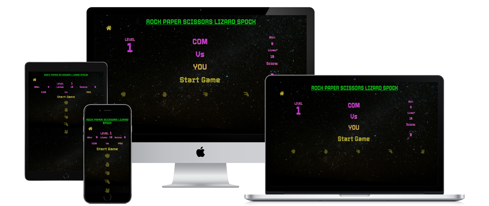
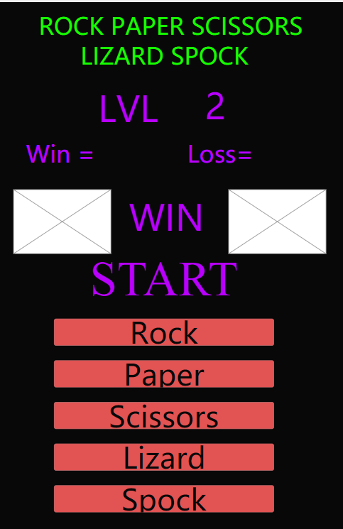

# Rock Paper Scissors Lizard Spock
- 
- [Live Website](https://jenns93.github.io/Roc-Paper-Scissors-Lizard-Spock/)
- [Github Repository](https://github.com/jenns93/Rock-Paper-Scissors-Lizard-Spock)
 # About
This website has been created for those looking to play the enhanced version of the timeless classic game of rock, paper, scissors. The game is a pure game of chance and is easy to grasp. For those who need further information rules are provided in the index page.

## Table of Contents

- [User Experience UX](#User-Experience-UX)
- [Design](#Design)

- [Features](#Features)
- [Specific to Pages](#Specific-to-Pages)

- [Technologies Used](#Technologies-Used)

- [Testing](#Testing)

- [Deployment](#Deployment)

- [Bugs](#Bugs)

- [Credits](#Credits)

## User Experience UX
### User Stories
i. As a visitor, I am looking to play a fun and engaging game of rock, paper, scissors, lizard, spock.
1. I want the layout of the site to be simple to navigate through.
2. I want the website to have an eye catching and fun design.
3. I want to be able to track my score as I play.
4. I want to be able to see what game button I selected.

i. As a visitor who is on the move
1. I want to be able to view the content on all my devices.
2. I want to the site to be laid out well on smaller screens so I can play just as easily on my phone.
3. I want a level structure to be present.

i. As a visitor who has never played this version of the game.
1. I want to be able to go back from the game to read the rules.
2. I want the site to tell me if I have won or lost.
3. I want the game to have a retro/arcade design.

## Design
### Colour scheme
- This website has be design to be bold and bright with neon type colours such as (rgb(199, 30, 241))and(#14e91f) against a dark background to give the impression of the classic arcade games of the 1970's.
### Typography
- The main text font on the site is Tourney which enhances the retro design, this has been paired with Source San pro for text heavy areas such as the rule list. Some parts of the game text have the add style of text shadow which helps to draw the user's eye to important data within the game and improve readability.
### Imagery
- The images used on the website have been selected to provide enhance the contrast between the background and the text. Also, the imagery of space goes hand in hand with promoting the idea of a classic arcade design.
### Wireframes
- The wireframes were created using Mockplus, theses wireframes were followed closely with slight tweaks made for better usability on different screen sizes. Also, the addition of a hidden rule list which has to be clicked to open was added during development as a way for the index page to appear cleaner and less cluttered.

- [Wireframes](https://app.mockplus.com/app/OKWZplGhIrf/rp)
## Features
### Header
- The heading of the sites index page reads the title with icons incorporated into the design.
### Navbar
- The home link on the nav bar displays a hover function with a coloured background on the game page that will return the user to the index page. A similar link is provided on the index page with the same functions to allow the user to enter the game page.
- For small screen sizes (mobile) the navigation elements of the site shrink the fit the space available.
### Buttons
- All buttons have a hover function which enables a background colour.
- Game buttons are dimmed in colour when they are unavailable to use, to help the user experience.
### Accessibility
- Titles for webpage are provided.
- Bright colours and simple design provided to achieve better readability when playing the game.
- Labels for buttons provided for screen readers.
### Responsiveness
- All site pages respond with the same functionality for all screen sizes.
## Specific to Pages
### Home
- Home page provides a large link to the game page.
- Expandable rule list button which provides win and loss criteria for the game.
- Also in the rule list are the conditions for levelling up and game over.
### Game
- Main content pages are all structured in the same retro style with consistent colour throughout.
- To begin game a "start game" button is provided along with description of output areas where "user / computer" outputs will be displayed on screen.
- Win / Lose / Draw out puts are displayed as the user plays through the game.
- A level counter is displayed and reacts to the users score along with the win / lose counters and a total score counter.
- When the lose criteria is met the game is stopped and the user is informed that it is "game over" and is given their final score.
- When "game over" is initiated the user output buttons are dimmed to show they are deactivated. Also, a "play again" button is displayed to allow the user to try again.
### Future Features
- High score table to encourage users to attempt to beat their previous score.
- The addition of different game modes for example a time trial, where the user is under time pressure to select an answer.
- Addition of animation to enhance user enjoyment.    
## Technologies Used

### Languages Used

- HTML5

- CSS3

- JavaScript

### Frameworks, libraries and programs used

-[Mockplus](https://www.mockplus.com/) Mockplus was used to create the wireframe designs for the site on two screen sizes desktop and (tablet/mobile).

-[Font-Awesome](https://fontawesome.com/) Font Awesome was used to provide icons for additional styling to heading and game buttons.

-[Google-Fonts](https://fonts.google.com/) Google Fonts was used to import Tourney & Source san pro into the style.css stylesheet

-[Github](https://github.com/) Github was used to host the files and to publish the finished website.

-[Gitpod](https://www.gitpod.io/) Gitpod was used to code the website and commit changes throughout the development to Github.

-[Pexels](https://www.pexels.com/) Pexels was used to source stock photos to be used for the website background to enhance the design of the site.

## Testing

### Functionality Testing
#### Navigation

- When the heading of “Let’s play” is clicked it will direct the user to the game page, likewise in reverse when house icon is pressed it will return the user to the index screen. These have been tested on multiple screen sizes and browsers.
- The links will display a coloured background when hovered over, to inform that it is functional.
#### Buttons
- The user game buttons are darker when deactivated (rgb(204, 194, 57, 0.4)) and in full colour when active (rgb(204, 194, 57)).
- All buttons have hover styling across the website with a slight tint of (rgba(230, 83, 149, 0.38)) displayed behind the text.
- At 800px wide the game buttons will stack on top of each to allow for larger text and to improve ease of use on smaller screen sizes.
- At 1500px + wide the game buttons will increase in size to accommodate the larger screen.
#### Game
- The game interface consists of four main areas.
- The first area is the level counter which will inform the user on their progression through the game. The counter is triggered by the player beating the computer three times, which will increase the level.
- The second area is the main body of the game, which will inform the user of their own selection, the selection of the computer and the result of the round (Win/Lose/Draw). This area is also used to initiate the game when first loaded and to restart the game when the user has lost the game.
- The third area comprises of the score counters; these handle the wins that the player has achieved for that level. This will reset on each level. Also, in this area is the “lives” counter which will reduce every time the player loses until it reaches zero. Lastly is the counter which handles the players total score, which will be displayed to the user as well when the game is finished.
- The last area of the game page are the control buttons; these will display dimly when deactivated in such scenarios as before the game is initiated and when the game is over. When the buttons are active, they are brighter in colour and display a coloured background when hovered over.
- At 800px the four game areas will stack on top of one another for better usability on smaller devices.
### CSS3 Validator - Pass

    

### HTML5 Validator

- Index Page - Pass [Results](https://validator.w3.org/nu/?doc=https%3A%2F%2Fjenns93.github.io%2FRock-Paper-Scissors-Lizard-Spock%2Findex.html)

- Game Page - Pass [Results](https://validator.w3.org/nu/?doc=https%3A%2F%2Fjenns93.github.io%2FRock-Paper-Scissors-Lizard-Spock%2Fgame.html)

### Javascript Validator
[Validator screenshot](assets/images/jsHint-validator.png)
- JSHint [weblink](https://jshint.com/)
- 1 waring "Functions declared within loops referencing an outer scoped variable may lead to confusing semantics. (activateButtons, rock, paper, scissors, lizard, spock)"
- (// jshint esversion: 6) used in jsHint but not added into github code as project criteria states that commented code should be removed.

### Usability Testing

-Testing of the ease of navigation was done with the sharing of the site with friends/family of various levels of technology knowledge. No issues for difficulty of navigation were raised.

-Users confirmed that all links provide were functional on various devices.

### Compatibility Testing

#### Browser Compatibility
| Device      | Safari            |  Microsoft Edge    | Chrome             | Internet Explorer  | FireFox            |
| ----------- | -----------       | -----------        | -----------        | -----------        | -----------        |
| Desktop     | Not Tested        |:heavy_check_mark:  |:heavy_check_mark:  |:heavy_check_mark:  |:heavy_check_mark:  |
| Tablet      | :heavy_check_mark:|:heavy_check_mark:  |:heavy_check_mark:  |:heavy_check_mark:  |:heavy_check_mark:  |
| Mobile      | Not Tested        |:heavy_check_mark:  |:heavy_check_mark:  |:heavy_check_mark:  |:heavy_check_mark:  |

- Devices used in this testing include: Dell desktop PC, Asus laptop and various android smart phones.
- In addition the site has been tested on the selection of device screen sizes provided in [Chrome DevTools](https://developer.chrome.com/docs/devtools/) such as : Galaxy S5, Iphone X and Ipad.  

### Performance Testing

- Site performance was tested using [WebPageTest](https://www.webpagetest.org/)
- Areas of improvement recommended by the tester were security and Cache static which are beyond the scope of this project, though when this information is learned it will be added to future projects. 

- Index page [Results](https://www.webpagetest.org/result/210713_AiDcP7_f5a6f9896a987fcc5fca0d9aa7b8b146/)

- Game page [Results](https://www.webpagetest.org/result/210713_AiDcG7_1c32c0a503cd1475c61c5f96959a044d/)

### Testing User Stories

i. As a visitor, I am looking to play a fun and engaging game of rock, paper, scissors, lizard, spock.
1. I want the layout of the site to be simple to navigate through.
- The user will find the layout of the site easy to navigate thanks to it's simple design.
2. I want the website to have an eye catching and fun design.
- The website has a strong theme throughout, with bold bright colours.
3. I want to be able to track my score as I play.
- The user will have constant view of their current score and be given a final score when the game is over.
4. I want to be able to see what game button I selected.
- All buttons within the site have hover styling to assist with button selection.

ii. As a visitor who is on the move
1. I want to be able to view the content on all my devices.
- User will find that no matter the device they use, the site will respond for ease of play.
2. I want the site to be laid out well on smaller screens so I can play just as easily on my phone.
- The game will stack user buttons on smaller screen sizes with 100% width so that as long as they click inline with the icon the button will still be selected.
3. I want a level structure to be present.
- The user is informed of how the level structure works and is given constant feedback on their level as they play.

iii. As a visitor who has never played this version of the game.
1. I want to be able to go back from the game to read the rules.
- The user can return to the index page at any time by clicking the house icon on the game screen.
2. I want the site to tell me if I have won or lost.
- The site will respond as the users plays and give accurate feedback as to who has won the round.
3. I want the game to have a retro/arcade design.
- The site has a retro design throughout inspired but 1970's arcade styles.

## Deployment
### Github Pages
- The project was deployed to GitHub Pages using the following steps...

1. Log in to GitHub and find the [GitHub Repository](https://github.com/)
2. At the top of the Repository section and select the "Settings" Button on the menu.
3. Scroll down the Settings page where you will see the "GitHub Pages" Section.
4. Underneath "Source", click the dropdown called "None" and select "Master Branch".
5. The page will refresh automatically once this is done.
6. Move down through the page and locate the published site link in the "GitHub Pages" section.

### Forking the GitHub Repository
To contribute you can Fork without affecting the main branch. Follow the instructions outlined below.

1. Go to GitHub and log in.
2. Find the Repository that was used for this project.
3. To the right of the Repository name you will see the 'Fork' button. This is located next to the 'Start' and 'Watch' buttons.
4. Doing this will place a copy in your own repository.
5. When you are finished locating the 'New Pull Request' button above the file list on the original repository.

### Cloning
- To clone or download the repository to your own device follow the instructions listed below.

1. Head to Github and log in.
2. Find the Repository for this site.
3. Below the name of the repository find the 'Clone or Download' green button.
4. To clone the repo using HTTPS click the link below "Clone with HTTPS".
5. Open your Terminal and go to the directory you want the cloned directory to be copied to.
6. Enter "Git Clone" and paste the URL copied from GitHub.
7. Create your local clone by pressing "Enter".

## Bugs
- No bugs have been found at time of writing.

## Credits

#### Code

- Code institute walkthrough “love Maths” for JavaScript structure layout 
- Code institute JavaScript essentials. 
- Stackoverflow for tips, examples concepts for further understanding of language definitions.
- w3schools for tips, examples concepts for further understanding of language definitions.

#### Content

- All code written by the author - Jack Jenns

- To create the README file inspiration was taken from:

- Code Institute [SampleREADME](https://github.com/Code-Institute-Solutions/SampleREADME)
- Code Institute [README Template](https://github.com/Code-Institute-Solutions/readme-template)
- [Markdown cheat sheet](https://github.com/adam-p/markdown-here/wiki/Markdown-Cheatsheet)

- Information (rules) and images for the website from:
- [Big Bang theory]( https://the-big-bang-theory.com/rock-paper-scissors-lizard-spock/)
- [Pexels](https://www.pexels.com/)

### Acknowledgements
- Stackoverflow.
- Fellow students on slack.
- My mentor for his guidance.
- w3schools. 
